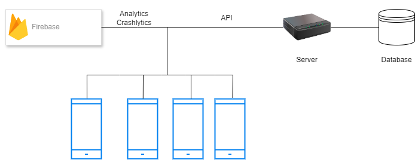

# ChitChat

## Introduction
ChitChat is a mobile chat application that allows users to communicate in real-time. With features like secure messaging, user authentication, and an intuitive interface, ChitChat aims to provide a seamless chatting experience.

## Project architecture diagram

## Technologies Used
- **Kotlin**: The primary programming language for Android development.
- **Firebase Crashlytics**: For real-time crash reporting.
- **Firebase Analytics**: To collect and analyze user engagement data.
- **Firebase App Distribution**: For distributing pre-release versions of the app to testers.
- **Hilt**: Dependency injection for Android.
- **Room**: For local database management.
- **Retrofit**: For network operations and API interactions.

## Requirements
- **Android Studio**: Make sure you have the latest version of Android Studio installed.

## Installation
To set up the ChitChat project locally, follow these steps:

1. Open Android Studio
2. New > Project from version control > https://github.com/AntonioJesusRM/ChitChat.git
3. Sync the Gradle files.
4. Build and run the app on an emulator or physical device.

## Usage
Once the application is running, users can:

- Register or log in.
- Start a new chat.
- Send messages.
- Access the profile.
- Set up initialization with biometric mode.
- Close your session.

